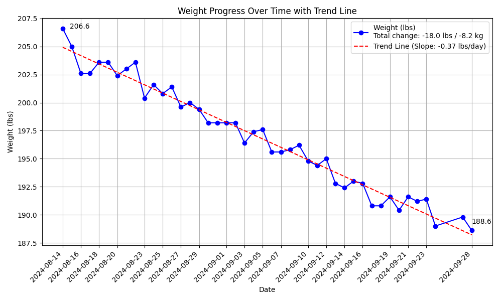

# Weight Tracker

A simple command-line weight tracking application that allows users to log their weight, visualize progress over time, and analyze trends.

## Features

- Log daily weight measurements
- Generate graphs showing weight progress over time
- Visualize trend lines to understand overall weight change direction
- Customize date ranges for graph generation
- Import historical weight data
- Save graphs as PNG files in the Downloads folder

## Example Graph


## Installation

1. Clone this repository:
   ```
   git clone https://github.com/yourusername/weight-tracker.git
   cd weight-tracker
   ```

2. Install required dependencies:
   ```
   pip install matplotlib numpy scikit-learn
   ```

## Usage

Run the script with various command-line arguments:


### Arguments:

- `weight`: The weight to log (optional)
- `-d, --date`: Date to log weight (YYYY-MM-DD), defaults to today
- `-r, --range`: Graph range (1m, 6m, 1y, or all)
- `-f, --from-date`: Start date for graph (YYYY-MM-DD)
- `-s, --set-default`: Set the current range as default
- `--import-history`: Import historical data from weights.py
- `-g, --graph-only`: Generate graph without logging weight

### Examples:

1. Log today's weight:
   ```
   python weight_tracker.py 70.5
   ```

2. Log weight for a specific date:
   ```
   python weight_tracker.py 71.2 -d 2023-05-01
   ```

3. Generate a graph for the last 6 months and save 6 months:
   ```
   python weight_tracker.py -r 6m -g
   ```

4. Generate a graph for all weights since 2024-08-14 and save that as the default range:
   ```
   python weight_tracker.py -f 2024-08-14 -s -g
   ```

5. Import historical data and generate a graph:
   ```
   python weight_tracker.py --import-history
   python weight_tracker.py -g
   ```

## Data Storage

Weight data is stored in an SQLite database (`weight_tracker.db`) in the same directory as the script.

## Customization

You can customize the graph appearance by modifying the `generate_graph` function in the script.

## Contributing

Contributions are welcome! Please feel free to submit a Pull Request.

## License

This project is open source and available under the [MIT License](LICENSE).
